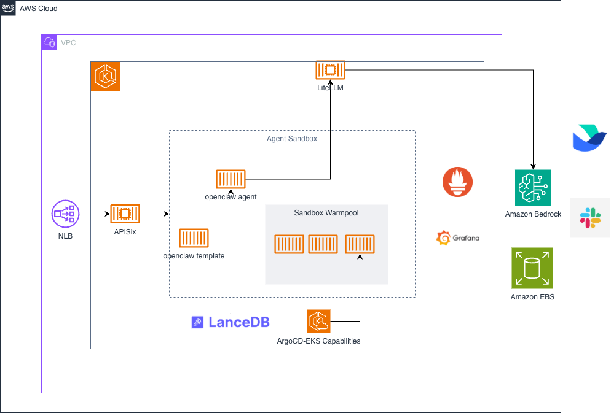

# OpenClaw on EKS with Kata Containers and LiteLLM

## Introduction

This blueprint deploys OpenClaw AI agents with sandbox isolation using Kata containers on Amazon EKS, integrated with LiteLLM proxy for Claude Opus 4.6 access via AWS Bedrock. The solution provides secure, isolated agent environments for Slack and Feishu integrations with enterprise-grade security, scalability, and observability.

**Key Features:**

- **VM-level Isolation**: Kata containers provide lightweight VM isolation for each sandbox
- **Autoscaling**: Karpenter automatically provisions bare-metal instances on-demand
- **Observability**: Prometheus and Grafana for metrics, with pre-built LiteLLM dashboard
- **Sandbox Lifecycle**: CRD-based sandbox management with warm pool and template support
- **Secure AI Access**: EKS Pod Identity for AWS Bedrock authentication (no static credentials)
- **Multi-channel**: Support for Slack and Feishu integrations
- **Persistent Workspaces**: EBS-backed storage for agent state and data

## Architecture

- **EKS Cluster**: Managed Kubernetes cluster (v1.31) with core node group and Karpenter autoscaling
- **Kata Containers**: Lightweight VM isolation using QEMU hypervisor on bare-metal instances
- **LiteLLM Proxy**: OpenAI-compatible API gateway to AWS Bedrock with PostgreSQL backend
- **OpenClaw Sandboxes**: CRD-managed isolated agent environments with persistent storage
- **Storage**: EBS CSI driver with gp3 volumes for workspace persistence
- **Networking**: VPC with public/private subnets across 3 AZs
- **Security**: EKS Pod Identity for AWS Bedrock access (no long-lived credentials)
- **Observability**: Prometheus (50Gi, 15d retention) and Grafana with LiteLLM metrics



## Deploying the Solution

### Prerequisites

Ensure that you have installed the following tools on your machine:

1. [AWS CLI](https://docs.aws.amazon.com/cli/latest/userguide/install-cliv2.html)
2. [kubectl](https://kubernetes.io/docs/tasks/tools/)
3. [terraform](https://learn.hashicorp.com/tutorials/terraform/install-cli)
4. [helm](https://helm.sh/docs/intro/install/) (v3.x)

### Deploy

Clone the repository:

```bash
git clone https://github.com/hitsub2/openclaw-on-eks
cd openclaw-on-eks
export OPENCLAW_HOME=$(pwd)
```

If `OPENCLAW_HOME` is ever unset, you can always set it manually using `export OPENCLAW_HOME=$(pwd)` from your openclaw-kata-eks directory.

Run the installation script:

```bash
chmod +x install.sh
./install.sh
```

**Deploy to a different region:**

```bash
# Deploy to ap-southeast-1
./install.sh --region ap-southeast-1

# Deploy to us-east-1 with custom cluster name
./install.sh --region us-east-1 --cluster-name my-openclaw

# Or use environment variables
AWS_REGION=ap-southeast-1 ./install.sh
```

**Available options:**
- `--region REGION` - AWS region (default: us-west-2)
- `--cluster-name NAME` - EKS cluster name (default: openclaw-kata-eks)
- `--help` - Show help message

The script will:
- Check prerequisites (aws cli, kubectl, terraform, helm)
- Initialize Terraform
- Plan and apply infrastructure
- Configure kubectl
- Wait for cluster to be ready
- Display next steps

### Deployment Outputs

After successful deployment, Terraform will display:

```
Outputs:

cluster_endpoint = "https://XXXXX.gr7.us-west-2.eks.amazonaws.com"
cluster_name = "openclaw-kata-eks"
configure_kubectl = "aws eks --region us-west-2 update-kubeconfig --name openclaw-kata-eks"
grafana_access = "kubectl port-forward -n monitoring svc/kube-prometheus-stack-grafana 3000:80"
grafana_admin_password = <sensitive>
grafana_service_name = "kube-prometheus-stack-grafana"
kata_namespace = "kata-system"
litellm_db_admin_password = <sensitive>
litellm_db_password = <sensitive>
openclaw_namespace = "openclaw"
```

This deployment creates:

**Infrastructure:**
- EKS cluster (v1.31) with core node group (m5.xlarge, 1-3 nodes)
- VPC with 3 availability zones, public/private subnets, NAT gateway
- EBS CSI driver with IRSA role and default StorageClass (gp3, 100Gi root volume)

**Compute & Runtime:**
- Kata containers runtime (QEMU hypervisor) on bare-metal instances
- Karpenter NodePool for autoscaling (m5.metal, m5d.metal, c5.metal, c5d.metal)
- Bare-metal nodes with RAID0 NVMe setup (200Gi root volume)
- Agent sandbox controller with CRDs

**AI & Proxy:**
- LiteLLM proxy with standalone PostgreSQL (50Gi EBS storage)
- Claude Opus 4.6 model via AWS Bedrock cross-region inference (us-east-1)
- EKS Pod Identity for secure Bedrock access

**Monitoring:**
- Prometheus with 50Gi EBS storage (15 day retention)
- Grafana with 10Gi EBS storage (ClusterIP service)
- ServiceMonitor for LiteLLM metrics collection

Configure kubectl:

```bash
aws eks --region us-west-2 update-kubeconfig --name openclaw-kata-eks
```

Verify the deployment:

```bash
# Check cluster
kubectl get nodes

# Check Kata runtime
kubectl get runtimeclass

# Check LiteLLM
kubectl get pods -n litellm

# Check sandboxes
kubectl get sandbox -A
```

## LiteLLM Configuration

### Access Information

LiteLLM is deployed as an internal service accessible within the cluster:

- **Service**: `litellm.litellm.svc.cluster.local:4000`
- **Database**: Standalone PostgreSQL with `STORE_MODEL_IN_DB=True`
- **UI**: Port-forward to access the admin UI: `kubectl port-forward -n litellm svc/litellm 4000:4000`

Retrieve the master key:

```bash
kubectl get secret litellm-masterkey -n litellm -o jsonpath='{.data.masterkey}' | base64 -d
```

### Adding a Model via UI

1. Port-forward the LiteLLM service:

```bash
kubectl port-forward -n litellm svc/litellm 4000:4000
```

2. Open `http://localhost:4000/ui` in your browser

3. Login with the master key (retrieved above)

4. Navigate to **Models** → **Add Model** and fill in:
   - **Model Name**: e.g. `Qwen/Qwen2.5-72B-Instruct`
   - **Provider**: `openai` (for any OpenAI-compatible API)
   - **API Base**: your provider's endpoint, e.g. `https://api.siliconflow.cn/v1`
   - **API Key**: your provider's API key

5. Click **Save**

### Adding a Model via Terraform

Models can also be configured directly in `litellm.tf`:

```hcl
set {
  name  = "proxy_config.model_list[0].model_name"
  value = "Qwen/Qwen2.5-72B-Instruct"
}

set {
  name  = "proxy_config.model_list[0].litellm_params.model"
  value = "openai/Qwen/Qwen2.5-72B-Instruct"
}

set {
  name  = "proxy_config.model_list[0].litellm_params.api_base"
  value = "https://api.siliconflow.cn/v1"
}

set {
  name  = "proxy_config.model_list[0].litellm_params.api_key"
  value = "<your-api-key>"
}
```

Then run `terraform apply` to update.

### Generate API Key for OpenClaw

Generate a dedicated API key for OpenClaw sandboxes:

```bash
MASTER_KEY=$(kubectl get secret litellm-masterkey -n litellm -o jsonpath='{.data.masterkey}' | base64 -d)

YOUR_LITELLM_API_KEY=$(kubectl run -n litellm gen-key --rm -i --restart=Never \
  --image=public.ecr.aws/docker/library/busybox:1.33.1 -- \
  wget -qO- --post-data='{"models": ["Qwen/Qwen2.5-72B-Instruct"], "duration": "30d"}' \
  --header="Authorization: Bearer $MASTER_KEY" \
  --header="Content-Type: application/json" \
  http://litellm:4000/key/generate | grep -o '"key":"[^"]*"' | cut -d'"' -f4)

echo "YOUR_LITELLM_API_KEY: $YOUR_LITELLM_API_KEY"
```

Use the returned `key` value as the `apiKey` in OpenClaw's LiteLLM provider configuration.

### Test LiteLLM Connection

```bash
MASTER_KEY=$(kubectl get secret litellm-masterkey -n litellm -o jsonpath='{.data.masterkey}' | base64 -d)

kubectl run -n litellm test --rm -i --restart=Never \
  --image=public.ecr.aws/docker/library/busybox:1.33.1 -- \
  wget -qO- --post-data='{"model": "Qwen/Qwen2.5-72B-Instruct", "messages": [{"role": "user", "content": "Hi"}], "max_tokens": 20}' \
  --header="Authorization: Bearer $MASTER_KEY" \
  --header="Content-Type: application/json" \
  http://litellm:4000/v1/chat/completions
```

## OpenClaw Sandbox Deployment

### Slack Integration

#### 1. Create Slack App

Create a Slack app at https://api.slack.com/apps:

- Enable Socket Mode
- Add Bot Token Scopes:
  - `chat:write`
  - `im:write`
  - `im:history`
  - `channels:history`
  - `groups:history`
  - `mpim:history`
- Install app to workspace
- Copy Bot Token (`xoxb-...`) and App Token (`xapp-...`)

#### 2. Configure Sandbox

Update `examples/openclaw-slack-sandbox.yaml` with your credentials:

```bash
cd ${OPENCLAW_HOME}/examples

# Set Slack tokens
export SLACK_BOT_TOKEN="xoxb-..."
export SLACK_APP_TOKEN="xapp-..."

# Replace placeholders (LITELLM_API_KEY already set from previous step)
sed -i.bak \
  -e "s/YOUR_LITELLM_API_KEY/${LITELLM_API_KEY}/g" \
  -e "s/YOUR_BOT_TOKEN/${SLACK_BOT_TOKEN}/g" \
  -e "s/YOUR_APP_TOKEN/${SLACK_APP_TOKEN}/g" \
  openclaw-slack-sandbox.yaml
```

#### 3. Deploy Sandbox

```bash
kubectl apply -f openclaw-slack-sandbox.yaml

# Monitor deployment
kubectl get sandbox openclaw-slack-sandbox
kubectl get pods -l sandbox=openclaw-slack-sandbox -w

# Check logs
kubectl logs -f openclaw-slack-sandbox
```

The sandbox will:
- Create a Kata VM-isolated pod on bare-metal nodes
- Mount a 2Gi EBS volume for workspace persistence
- Connect to LiteLLM proxy for Claude Opus 4.6 access
- Connect to Slack via Socket Mode

#### 4. Test in Slack

Once deployed, test the integration:

1. Open your Slack workspace
2. Find the bot in the Apps section or direct message it
3. Send a message like "Hello" or "What can you do?"
4. The bot should respond using Claude Opus 4.6 via LiteLLM

**Troubleshooting:**
- If no response, check pod logs: `kubectl logs -f openclaw-slack-sandbox`
- Verify Socket Mode is enabled in Slack app settings
- Ensure bot has correct permissions and is installed to workspace

### Feishu Integration

#### 1. Create Feishu App

Create a Feishu app at https://open.feishu.cn/:

- Get App ID and App Secret
- Configure event subscriptions
- Add required permissions

#### 2. Configure Sandbox

Update `examples/openclaw-feishu-sandbox.yaml` with your credentials:

```bash
cd ${OPENCLAW_HOME}/examples

# Set Feishu credentials
export FEISHU_APP_ID="cli_..."
export FEISHU_APP_SECRET="..."

# Replace placeholders (LITELLM_API_KEY already set from previous step)
sed -i.bak \
  -e "s/YOUR_LITELLM_API_KEY/${LITELLM_API_KEY}/g" \
  -e "s/YOUR_FEISHU_APP_ID/${FEISHU_APP_ID}/g" \
  -e "s/YOUR_FEISHU_APP_SECRET/${FEISHU_APP_SECRET}/g" \
  openclaw-feishu-sandbox.yaml
```

#### 3. Deploy Sandbox

```bash
kubectl apply -f openclaw-feishu-sandbox.yaml

# Monitor deployment
kubectl get sandbox openclaw-feishu-sandbox
kubectl get pods -l sandbox=openclaw-feishu-sandbox -w

# Check logs
kubectl logs -f openclaw-feishu-sandbox
```

The sandbox will:
- Create a Kata VM-isolated pod on bare-metal nodes
- Mount a 2Gi EBS volume for workspace persistence
- Connect to LiteLLM proxy for Claude Opus 4.6 access
- Connect to Feishu via webhook

#### 4. Test in Feishu

Once deployed, test the integration:

1. Open your Feishu app
2. Find the bot in the app list or direct message it
3. Send a message like "你好" or "What can you do?"
4. The bot should respond using Claude Opus 4.6 via LiteLLM

**Troubleshooting:**
- If no response, check pod logs: `kubectl logs -f openclaw-feishu-sandbox`
- Verify webhook URL is correctly configured in Feishu app settings
- Ensure app has correct permissions and event subscriptions
- Check that App ID and App Secret are correct

## Deploy Hermes Agent Example

[Hermes Agent](https://github.com/NousResearch/hermes-agent) is an open-source AI agent by Nous Research with persistent memory, self-improving skills, and multi-platform messaging support. This section deploys Hermes Agent as a Kata-isolated sandbox with Feishu integration, using LiteLLM for model access.

### Prerequisites

- LiteLLM is deployed and accessible (see [LiteLLM Configuration](#litellm-configuration))
- A Feishu app created at [open.feishu.cn](https://open.feishu.cn) with:
  - **Bot** capability enabled
  - Permissions: `im:message`, `im:message:send_as_bot`
  - Event subscription: `im.message.receive_v1`
  - App published and approved

### 1. Generate a LiteLLM API Key for Hermes

```bash
MASTER_KEY=$(kubectl get secret litellm-masterkey -n litellm -o jsonpath='{.data.masterkey}' | base64 -d)

kubectl port-forward svc/litellm -n litellm 4000:4000 &
PF_PID=$!
sleep 3

HERMES_API_KEY=$(curl -s -X POST "http://localhost:4000/key/generate" \
  -H "Authorization: Bearer $MASTER_KEY" \
  -H "Content-Type: application/json" \
  -d '{"key_alias": "hermes-agent"}' | python3 -c "import sys,json;print(json.load(sys.stdin)['key'])")

kill $PF_PID 2>/dev/null
echo "HERMES_API_KEY: $HERMES_API_KEY"
```

### 2. Create Kubernetes Secrets

```bash
kubectl create ns hermes

# LiteLLM API key
kubectl create secret generic hermes-litellm-key -n hermes \
  --from-literal=api-key="${HERMES_API_KEY}"

# Feishu credentials
kubectl create secret generic hermes-feishu -n hermes \
  --from-literal=app-id='YOUR_FEISHU_APP_ID' \
  --from-literal=app-secret='YOUR_FEISHU_APP_SECRET'
```

### 3. Create Hermes ConfigMap

```bash
kubectl apply -f - <<'EOF'
apiVersion: v1
kind: ConfigMap
metadata:
  name: hermes-config
  namespace: hermes
data:
  config.yaml: |
    model:
      default: "claude-opus-4-6"
      provider: "custom"
      base_url: "http://litellm.litellm.svc.cluster.local:4000/v1"
    terminal:
      backend: "local"
      cwd: "/mnt/workspace"
      timeout: 180
    agent:
      max_turns: 60
    memory:
      memory_enabled: true
      user_profile_enabled: true
    display:
      streaming: true
EOF
```

Adjust `model.default` to match a model name configured in your LiteLLM instance. List available models:

```bash
MASTER_KEY=$(kubectl get secret litellm-masterkey -n litellm -o jsonpath='{.data.masterkey}' | base64 -d)
kubectl run -n litellm list-models --rm -i --restart=Never \
  --image=curlimages/curl -- \
  curl -s http://litellm:4000/v1/models -H "Authorization: Bearer $MASTER_KEY" | python3 -c "import sys,json;[print(m['id']) for m in json.load(sys.stdin)['data']]"
```

### 4. Deploy Hermes Sandbox

Save the following as `examples/hermes-feishu-sandbox.yaml`:

```yaml
apiVersion: agents.x-k8s.io/v1alpha1
kind: Sandbox
metadata:
  name: hermes-feishu-sandbox
  namespace: hermes
spec:
  podTemplate:
    metadata:
      labels:
        sandbox: hermes-feishu-sandbox
    spec:
      runtimeClassName: kata-qemu
      automountServiceAccountToken: true
      securityContext:
        runAsUser: 1000
        runAsGroup: 1000
        fsGroup: 1000
      nodeSelector:
        katacontainers.io/kata-runtime: "true"
      tolerations:
      - key: kata
        operator: Equal
        value: "true"
        effect: NoSchedule
      containers:
        - name: hermes
          image: nousresearch/hermes-agent:latest
          imagePullPolicy: IfNotPresent
          securityContext:
            allowPrivilegeEscalation: false
            readOnlyRootFilesystem: false
            runAsNonRoot: true
            capabilities:
              drop:
                - ALL
          command:
            - sh
            - -c
            - |
              mkdir -p /mnt/workspace/.hermes
              cp /config/config.yaml /mnt/workspace/.hermes/config.yaml
              exec /opt/hermes/.venv/bin/hermes gateway
          env:
          - name: HERMES_HOME
            value: "/mnt/workspace/.hermes"
          - name: OPENAI_API_KEY
            valueFrom:
              secretKeyRef:
                name: hermes-litellm-key
                key: api-key
          - name: FEISHU_APP_ID
            valueFrom:
              secretKeyRef:
                name: hermes-feishu
                key: app-id
          - name: FEISHU_APP_SECRET
            valueFrom:
              secretKeyRef:
                name: hermes-feishu
                key: app-secret
          - name: FEISHU_DOMAIN
            value: "feishu"
          - name: FEISHU_CONNECTION_MODE
            value: "websocket"
          - name: GATEWAY_ALLOW_ALL_USERS
            value: "true"
          resources:
            requests:
              cpu: "2"
              memory: "4Gi"
            limits:
              cpu: "2"
              memory: "4Gi"
          volumeMounts:
            - mountPath: /mnt/workspace
              name: workspaces-pvc
            - mountPath: /config
              name: config
      volumes:
        - name: config
          configMap:
            name: hermes-config
  volumeClaimTemplates:
    - metadata:
        name: workspaces-pvc
      spec:
        accessModes:
          - ReadWriteOnce
        resources:
          requests:
            storage: 10Gi
```

Deploy:

```bash
kubectl apply -f examples/hermes-feishu-sandbox.yaml
```

### 5. Verify Deployment

```bash
# Check sandbox status
kubectl get sandbox hermes-feishu-sandbox -n hermes

# Watch pod come up
kubectl get pods -n hermes -l sandbox=hermes-feishu-sandbox -w

# Check logs for Feishu WebSocket connection
kubectl logs -n hermes -l sandbox=hermes-feishu-sandbox --tail=20
```

You should see:

```
⚕ Hermes Gateway Starting...
[Lark] connected to wss://msg-frontier.feishu.cn/ws/v2?...
```

### 6. Test in Feishu

1. Open Feishu and find the bot in your app list
2. Send a direct message like "你好" or "Hello"
3. Hermes should respond via Claude through LiteLLM

### Key Differences from OpenClaw Sandbox

| Feature | OpenClaw | Hermes Agent |
|---------|----------|--------------|
| Config format | JSON in command | ConfigMap + K8s Secrets |
| Credentials | Inline in pod spec | K8s Secrets via `secretKeyRef` |
| Feishu connection | Webhook | WebSocket (no public URL needed) |
| Memory | Stateless | Persistent memory + skills |
| Gateway command | `node dist/index.js gateway` | `hermes gateway` |
| Model config | `openclaw.json` providers | `config.yaml` with `provider: custom` |

### Security Notes

- Feishu App Secret and LiteLLM API key are stored as K8s Secrets, not inline
- Set `GATEWAY_ALLOW_ALL_USERS=false` and use `FEISHU_ALLOWED_USERS=ou_xxx,ou_yyy` for production
- Kata VM isolation provides kernel-level separation from the host
- All Linux capabilities are dropped; privilege escalation is disabled
- Hermes WebSocket mode requires only outbound connectivity — no ingress needed

### Troubleshooting

| Problem | Solution |
|---------|----------|
| No response in Feishu | Check `im.message.receive_v1` event subscription is enabled in Feishu console |
| `All unauthorized users will be denied` | Set `GATEWAY_ALLOW_ALL_USERS=true` or configure `FEISHU_ALLOWED_USERS` |
| `Invalid model name` | Run the list-models command above and update `model.default` in ConfigMap |
| `hermes: executable file not found` | Binary is at `/opt/hermes/.venv/bin/hermes`, not in PATH |
| Pod stuck in Pending | Check Karpenter is provisioning bare-metal nodes: `kubectl logs -n karpenter -l app.kubernetes.io/name=karpenter` |
| PVC Multi-Attach error | Scale deployment to 0 first, wait for old pod to terminate, then scale back up |

## Monitoring with Prometheus and Grafana

### Access Grafana

Get the admin password:

```bash
# Via Terraform
terraform output -raw grafana_admin_password

# Or via kubectl
kubectl get secret -n monitoring kube-prometheus-stack-grafana -o jsonpath='{.data.admin-password}' | base64 -d && echo
```

Access Grafana via port-forward:

```bash
kubectl port-forward -n monitoring svc/kube-prometheus-stack-grafana 3000:80
```

Open http://localhost:3000 in your browser:
- Username: `admin`
- Password: Use the password from the command above

### Import LiteLLM Dashboard

A pre-configured Grafana dashboard for LiteLLM is provided in `examples/grafana/grafana_dashboard.json`.

To import:

1. Access Grafana (see above)
2. Navigate to **Dashboards** → **Import**
3. Upload the dashboard file:
   ```bash
   examples/grafana/grafana_dashboard.json
   ```
4. Select the Prometheus data source
5. Click **Import**

The dashboard includes:
- **Proxy Level Metrics**: Total requests, failed requests, request rates
- **Token Metrics**: Input/output tokens, total tokens per model
- **Latency Metrics**: Request latency, LLM API latency, time to first token
- **Deployment Metrics**: Success/failure rates per deployment
- **Budget Metrics**: Spend tracking per team, user, and API key
- **Rate Limit Metrics**: Remaining requests and tokens

### Verify Metrics Collection

Check that Prometheus is scraping LiteLLM metrics:

```bash
# Check ServiceMonitor
kubectl get servicemonitor -n litellm

# Check Prometheus targets (via port-forward)
kubectl port-forward -n monitoring svc/kube-prometheus-stack-prometheus 9090:9090
# Open http://localhost:9090/targets and look for litellm
```

Test metrics endpoint directly:

```bash
kubectl run -n litellm test-metrics --rm -i --restart=Never --image=curlimages/curl -- \
  curl -s http://litellm:4000/metrics | head -20
```

## Troubleshooting

### Check Sandbox Status

```bash
# List all sandboxes
kubectl get sandbox -A

# Describe sandbox
kubectl describe sandbox openclaw-slack-sandbox

# Check pod status
kubectl get pods -l sandbox=openclaw-slack-sandbox

# View logs
kubectl logs openclaw-slack-sandbox --tail=50

# Check events
kubectl get events --sort-by='.lastTimestamp' | grep openclaw
```

### Check LiteLLM Status

```bash
# Check pods
kubectl get pods -n litellm

# View LiteLLM logs
kubectl logs -n litellm deployment/litellm --tail=50

# View PostgreSQL logs
kubectl logs -n litellm litellm-postgresql-0 --tail=50

# Test health endpoint
kubectl run -n litellm test --rm -i --restart=Never --image=curlimages/curl -- \
  curl -s http://litellm:4000/health/readiness
```

### Check Kata Runtime

```bash
# Check Kata nodes
kubectl get nodes -l katacontainers.io/kata-runtime=true

# Check nodepool
kubectl get nodepool kata-bare-metal -o yaml

# Check Karpenter logs
kubectl logs -n karpenter -l app.kubernetes.io/name=karpenter --tail=50
```

### Common Issues

#### 1. Pod Stuck in Pending

**Symptom**: Sandbox pod remains in Pending state

**Solution**: Check if Karpenter provisioned bare-metal nodes

```bash
kubectl get nodes
kubectl describe nodepool kata-bare-metal
kubectl logs -n karpenter -l app.kubernetes.io/name=karpenter | grep kata
```

#### 2. Config Validation Errors

**Symptom**: Pod crashes with "Invalid config" errors

**Solution**: Check OpenClaw logs for specific field errors

```bash
kubectl logs openclaw-slack-sandbox | grep -A 5 "Invalid"
```

Common fixes:
- Ensure `apiKey` (not `auth`) is used for LiteLLM
- Use `openai-completions` API type
- Verify API key is valid and not expired

#### 3. LiteLLM Authentication Errors

**Symptom**: "Authentication Error" or "Invalid API key"

**Solution**: Verify API key and regenerate if needed

```bash
# Check if key exists
MASTER_KEY=$(kubectl get secret litellm-masterkey -n litellm -o jsonpath='{.data.masterkey}' | base64 -d)

# List existing keys
kubectl run -n litellm list-keys --rm -i --restart=Never --image=curlimages/curl -- \
  curl -s http://litellm:4000/key/info \
  -H "Authorization: Bearer $MASTER_KEY"

# Generate new key if needed
kubectl run -n litellm gen-key --rm -i --restart=Never --image=curlimages/curl -- \
  curl -s -X POST http://litellm:4000/key/generate \
  -H "Authorization: Bearer $MASTER_KEY" \
  -H "Content-Type: application/json" \
  -d '{"models": ["claude-opus-4-6"], "duration": "30d"}'
```

#### 4. Bedrock Access Denied

**Symptom**: "AccessDenied" errors when calling Bedrock

**Solution**: Verify Pod Identity association

```bash
# Check Pod Identity associations
aws eks list-pod-identity-associations \
  --cluster-name openclaw-kata-eks \
  --region us-west-2

# Check IAM role
aws iam get-role \
  --role-name openclaw-kata-eks-litellm-pod-identity \
  --region us-west-2

# Verify role has Bedrock permissions
aws iam list-attached-role-policies \
  --role-name openclaw-kata-eks-litellm-pod-identity \
  --region us-west-2
```

#### 5. Persistent Config Issues

**Symptom**: Config changes not taking effect

**Solution**: Delete PVC to force config recreation

```bash
# Delete sandbox and PVC
kubectl delete sandbox openclaw-slack-sandbox
kubectl delete pvc workspaces-pvc-openclaw-slack-sandbox

# Recreate
kubectl apply -f examples/openclaw-slack-sandbox.yaml
```

## Cleanup

Remove all resources:

```bash
# Delete sandboxes first
kubectl delete sandbox --all

# Wait for pods to terminate
kubectl get pods -A | grep openclaw

# Destroy infrastructure
terraform destroy
```

**Note**: Terraform destroy will remove all resources including EBS volumes and data.

## Cost Optimization

- **Bare-metal instances** (m5.metal, c5.metal) are expensive (~$4-6/hour)
  - Only provisioned when sandboxes are created
  - Karpenter automatically scales down after 30 seconds of inactivity
- **Core node group** runs continuously (~$0.04/hour per t3.medium)
- **EBS volumes** charged per GB-month (~$0.08/GB-month for gp3)
- **LiteLLM PostgreSQL** uses 8Gi EBS volume
- **Bedrock** charges per token (input/output)

**Recommendations**:
- Use Spot instances for non-production workloads
- Set appropriate Karpenter consolidation policies
- Monitor Bedrock usage via CloudWatch
- Delete unused sandboxes and PVCs

## Security Considerations

- **Secrets Management**: Master key and API keys stored in Kubernetes secrets
- **IAM**: EKS Pod Identity for Bedrock access (no long-lived credentials)
- **Isolation**: Sandboxes run in Kata VMs with separate kernel
- **Network**: Consider adding NetworkPolicies for additional isolation
- **Tokens**: Rotate Slack/Feishu tokens regularly
- **API Keys**: Set expiration on LiteLLM API keys (default 30 days)
- **Audit**: Enable EKS audit logging for compliance

## References

- [OpenClaw Documentation](https://github.com/openclaw/openclaw)
- [LiteLLM Documentation](https://docs.litellm.ai/)
- [Kata Containers](https://katacontainers.io/)
- [Karpenter](https://karpenter.sh/)
- [EKS Best Practices](https://aws.github.io/aws-eks-best-practices/)
- [AWS Bedrock](https://aws.amazon.com/bedrock/)

## Sandbox Configuration Details

### Runtime and Isolation

Each OpenClaw sandbox runs with:

- **Runtime**: `kata-qemu-static` - Lightweight VM isolation using QEMU hypervisor with static sandbox resource management
- **Architecture**: ARM64 (AWS Graviton) on `m6g.metal` bare-metal instances
- **Node Selector**: `workload-type: kata` - Scheduled only on bare-metal instances
- **Tolerations**: `kata=true:NoSchedule` - Ensures placement on dedicated Kata nodes
- **Service Account**: `openclaw-sandbox` - No IAM permissions (LiteLLM handles Bedrock access)
- **Security Context**:
  - Runs as non-root user (UID 1000, GID 1000)
  - All Linux capabilities dropped
  - Privilege escalation disabled
  - Read-only root filesystem disabled (required for OpenClaw)

#### Graviton with Custom Runtime (kata-qemu-static)

This deployment uses AWS Graviton (`m6g.metal`) bare-metal instances with a custom Kata runtime that enables `static_sandbox_resource_mgmt`. This means:

- The VM is pre-allocated with the exact CPU and memory requested at boot time
- No CPU/memory hotplug is used — resources are fixed from the start
- This is required for ARM64/Graviton since hotplug is not supported on this architecture

The custom runtime is configured via kata-deploy's `customRuntimes` with a drop-in override:

```yaml
customRuntimes:
  enabled: true
  runtimes:
    qemu-static:
      baseConfig: "qemu"
      dropIn: |
        [runtime]
        static_sandbox_resource_mgmt = true
      containerd:
        snapshotter: ""
      crio:
        pullType: ""
      runtimeClass: |
        kind: RuntimeClass
        apiVersion: node.k8s.io/v1
        metadata:
          name: kata-qemu-static
          labels:
            app.kubernetes.io/managed-by: kata-deploy
        handler: kata-qemu-static
        overhead:
          podFixed:
            memory: "160Mi"
            cpu: "250m"
        scheduling:
          nodeSelector:
            katacontainers.io/kata-runtime: "true"
```

To use this runtime in your pod spec:

```yaml
spec:
  runtimeClassName: kata-qemu-static
  containers:
    - name: my-workload
      resources:
        requests:
          cpu: "2"
          memory: "4Gi"
        limits:
          cpu: "2"
          memory: "4Gi"
  nodeSelector:
    workload-type: kata
  tolerations:
    - key: kata
      operator: Equal
      value: "true"
      effect: NoSchedule
```

The VM will boot with exactly the requested resources (plus 1 default vCPU for the Kata agent). For example, requesting 2 vCPUs results in a VM with 3 processors visible in `/proc/cpuinfo`.

### Storage and Persistence

- **Volume Type**: EBS gp3 via CSI driver
- **Size**: 2Gi per sandbox
- **Mount Path**: `/home/node/.openclaw`
- **Access Mode**: ReadWriteOnce
- **Lifecycle**: Persists across pod restarts, deleted with sandbox
- **Config Behavior**: 
  - Created on first run if not exists
  - Preserved on pod restart
  - Manual edits persist

### LiteLLM Integration

OpenClaw sandboxes connect to LiteLLM proxy with:

```json
{
  "models": {
    "providers": {
      "litellm": {
        "baseUrl": "http://litellm.litellm.svc.cluster.local:4000",
        "apiKey": "<generated-key>",
        "api": "openai-completions",
        "models": [{
          "id": "claude-opus-4-6",
          "name": "Claude Opus 4.6 (LiteLLM)",
          "reasoning": true,
          "input": ["text", "image"],
          "contextWindow": 200000,
          "maxTokens": 8192
        }]
      }
    }
  },
  "agents": {
    "defaults": {
      "model": { "primary": "litellm/claude-opus-4-6" }
    }
  }
}
```

**Key Points**:
- Uses cluster-internal service DNS (no external network required)
- API key generated via LiteLLM master key
- OpenAI-compatible API format
- LiteLLM handles AWS Bedrock authentication via Pod Identity

### Resource Allocation

**Per Sandbox Pod**:
- CPU: No limits (burstable)
- Memory: No limits (burstable)
- Storage: 2Gi EBS volume
- Network: Cluster network access

**Bare-metal Node** (when provisioned):
- Instance Type: m6g.metal (AWS Graviton)
- Architecture: ARM64
- CPU: 64 cores
- Memory: 256GB
- Root Volume: 200Gi gp3

### Channel Integrations

**Slack**:
- Connection: Socket Mode (WebSocket)
- Authentication: Bot Token + App Token
- Permissions: chat:write, im:write, im:history, channels:history
- DM Policy: Open (accepts DMs from all users)

**Feishu**:
- Connection: Webhook
- Authentication: App ID + App Secret
- Permissions: Configured in Feishu app settings
- DM Policy: Open (accepts messages from all users)

### Networking

- **Pod Network**: Uses VPC CNI (10.1.0.0/16)
- **Service Discovery**: Kubernetes DNS
- **LiteLLM Access**: ClusterIP service in `litellm` namespace
- **External Access**: None (sandboxes are internal only)
- **Channel Access**: Outbound HTTPS to Slack/Feishu APIs

